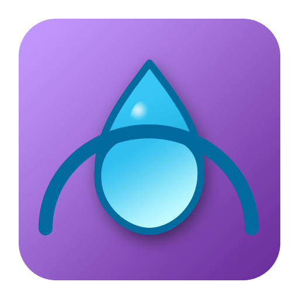

<p align="center">
  
</p>

<p align="center">
  <a href="https://www.npmjs.com/package/homebridge-rainsoft-remind"></a>
  <a href="https://github.com/dash16/homebridge-rainsoft-remind/stargazers"></a>
  <a href="https://github.com/dash16/homebridge-rainsoft-remind/issues"></a>
  <a href="https://github.com/dash16/homebridge-rainsoft-remind/blob/main/LICENSE"></a>
</p>

<h1 align="center">homebridge-rainsoft-remind</h1>
<p align="center"> 🌧️ A Homebridge plugin for monitoring your RainSoft system in HomeKit. </p>

## Features
- Automatic login to RainSoft Remind cloud
- Auto-discovery of your softener system
- HomeKit integration for easy monitoring
	- Reports **salt level** as a Battery Level sensor  
	- Reports **system status** (normal / needs attention) as a Contact Sensor  
	- Reports **remaining capacity until regeneration** as a Humidity Sensor  
- Configurable polling interval and “force update” option

## Requirements

- **Node.js:** v20, v22, or v24 (current LTS releases)
- **Homebridge:** v1.8.0 or newer (including 2.0 beta)
- **Platform type:** Dynamic platform plugin (single accessory representing your RainSoft system)

Tested on Node.js v20, v22, and v24 with Homebridge v1.8+.

## Installation
1. **Install via Homebridge UI:**
   - Search for `homebridge-rainsoft-remind` in the Homebridge Plugin Library.
   - Click **Install**.

2. **Or install manually:**
   
```bash
sudo npm install -g homebridge-rainsoft-remind
```
## 🧠 How It Works

The plugin securely authenticates to the RainSoft Remind API, discovers your device, and exposes its key metrics to HomeKit. It refreshes these metrics automatically on a schedule you control.

### How to Obtain Your Device ID and Auth Token (Manual configuration)

> ⚠️ Some values come from your **RainSoft Remind** mobile app but are not required for the plugin to connect.  This is optional if you don't feel comfortable storing your username and password in the config files.
> You only need to collect them once. Keep them private.

#### Using a Network Proxy (Charles Proxy or similar)
1. Install **Charles Proxy** (macOS) or **HTTP Toolkit** (Windows/Linux).
2. Enable HTTPS proxying and connect your phone or tablet to the same Wi-Fi network.
3. Open the **RainSoft Remind** app and refresh the *System Info* screen.
4. In Charles, look for a request like:
   `https://api.rainsoftremind.com/device/123456/status`
   - The `123456` part of that URL is your **Device ID**.
5. In that same request, look under **Headers** for:
   `X-Remind-Auth-Token: abcd1234-example-token-5678`
   - That long string is your **Auth Token**.
6. Copy those two values into the Homebridge plugin configuration fields.

### Security Notes
⚠️ **This plugin is unofficial and not affiliated with RainSoft.**

- Your Auth Token allows access to your RainSoft Remind account data.
- The token is stored only in your local Homebridge config and is sent only to the official RainSoft Remind API.
- Do **not** share screenshots of your Homebridge config screen publicly.

## Configuration

After installing, open the plugin’s Settings page in Homebridge UI.

| Field                | Description                                 |
| -------------------- | ------------------------------------------- |
| **Name**             | How it appears in Home                      |
| **Model Label**      | From RainSoft Remind → System Info → Model  |
| **Email**    		   | Username used in RainSoft Remind to log in  |
| **Password**    	   | Password used in RainSoft Remind to log in  |
| **Serial Number**    | From RainSoft Remind → System Info → Serial |
| **Device ID**        | Numeric ID from the RainSoft API URL        |
| **Auth Token**       | Value of `X-Remind-Auth-Token` header       |
| **Polling Interval** | How often to refresh (default 300 s)        |
| **Force Update**     | Request latest readings before each poll    |

You now have two ways to configure the plugin:

### Option A: Automatic (Recommended)

Let the plugin talk to your RainSoft Remind account and pull device info for you.

1. In Homebridge UI:

   * Go to **Plugins → homebridge-rainsoft-remind → Settings**
   * Enter:

     * RainSoft Email
     * RainSoft Password

2. Save and restart Homebridge.

What this does:

* The plugin will log in to the RainSoft Remind API using axios.
* It will request your device / location info (model, serial, etc.).
* Those details are then used to expose your softener to HomeKit.

Why this is nice:

* No packet sniffing.
* No manual deviceID/Auth Token scraping.

Security note:

* Your RainSoft email + password are stored in `config.json` the same way other Homebridge plugins store credentials.
* We do NOT send your credentials anywhere except directly to the RainSoft Remind API.
* We do NOT expose your credentials to HomeKit.

### Option B: Manual (No credentials stored)

If you don't want to save your RainSoft login:

1. In the Remind mobile app, note:

   * Device serial number
   * Model number

2. In Homebridge UI, leave the email/password blank and instead fill in the device info fields manually.

3. Input Auth Token and Device ID obtained from network proxy.

4. Save and restart Homebridge.

This behaves like v0.1.x.

---

### What gets created in HomeKit?

* Contact sensor - Off when the system is working normally.  Will flip on when the system has an alert or needs your attention, such as low salt levels or active regeneration.
* Occupancy sensor - When RainSoft system is actively regenerating, shows occupancy.
* Battery - Shows remaining salt in tank.
* Humidity Sensor - Shows capacity remaining before regeneration of resin filters.

---

### Troubleshooting / FAQ

🧰 Troubleshooting

* “Authentication failed” → Verify your RainSoft Remind username/password by logging in at remind.rainsoft.com
* No device found → Ensure your controller is connected to Wi-Fi and visible in the Remind mobile app.
* API timeout → Increase the pollSeconds value to reduce request frequency.

Run Homebridge in debug mode to see polling logs:
```bash
homebridge -D
```

## 📦 Version History

* v0.4.1 - v0.4.5 - Stability passes, fixed bugs introduced by plugin rewrite.
* v0.4.0 - Plugin rewrite using [Homebridge plugin template](https://github.com/homebridge/homebridge-plugin-template)
* v0.3.0 “Autodiscovery” – Full automatic login and device discovery (no Charles Proxy needed)
* v0.2.x – Manual device ID & token workflow
* v0.1.x – Initial proof-of-concept releases

## License

MIT © 2025 Dustin Newell